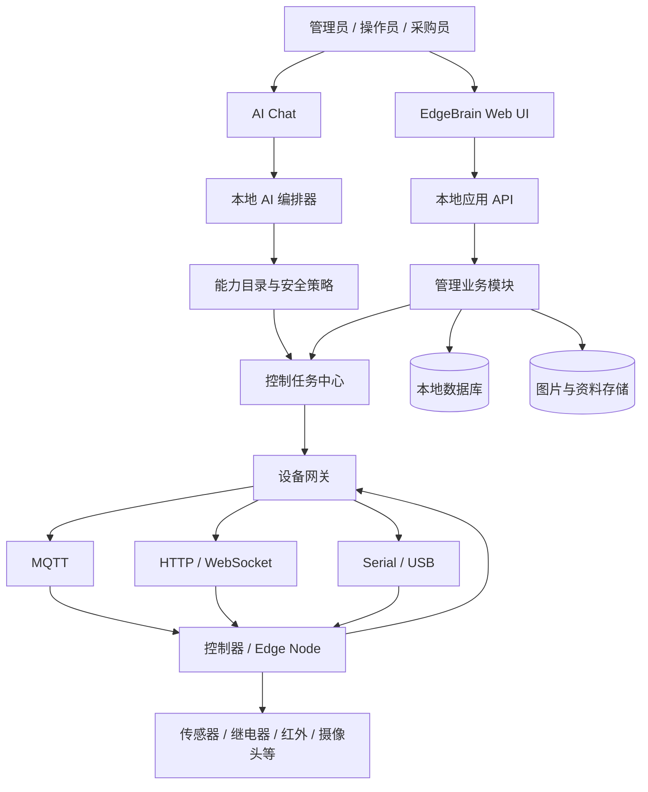
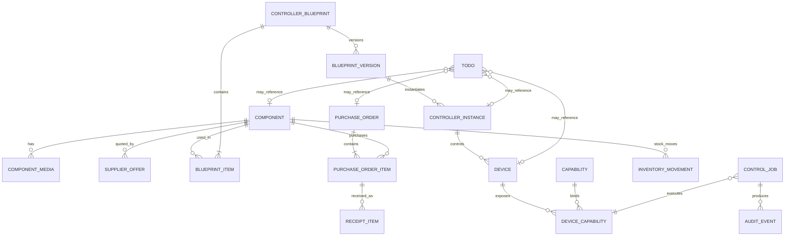
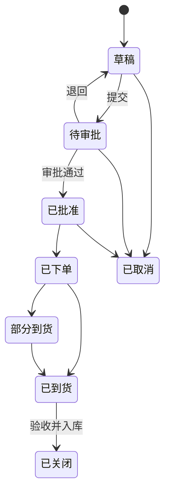
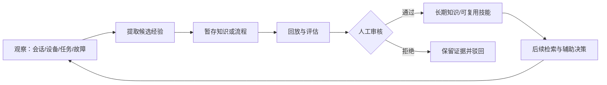
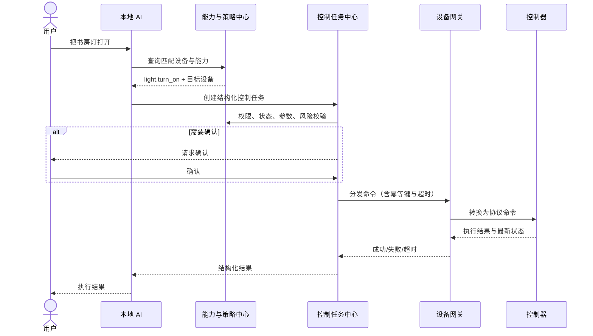

# EdgeBrain V0.1 管理系统架构设计

> 状态：架构草案  
> 日期：2026-08-28  
> 范围：电脑端侧 AI 硬件控制与设备管理系统；不包含机器人能力。

## 1. 架构结论

EdgeBrain V0.1 采用“本地模块化单体 + 独立设备网关 + Edge Node 固件”的形态，并以 Hermes 式自学习作为贯穿全系统的设计理念，而不是单独的产品页面。

- **管理应用**统一承载 UI、设备资产、控制器、配件、采购、库存、待办、权限和日志。
- **设备网关**专门处理 HTTP、MQTT、Serial 等连接，避免管理业务和硬件通信互相污染。
- **AI 编排器**只读取经过注册的能力目录，通过安全策略后创建控制任务，不直接生成底层硬件指令。
- **控制器方案**是硬件搭配的标准模板；每个实际组装的控制器都是某个方案版本的实例。
- **配件**是可采购、可入库、可装配的最小硬件资产，每个配件必须有图片和详细资料。
- **成长闭环**从设备测试、用户纠正、故障和成功工作流中提取候选知识；先暂存和评估，再经审核进入长期知识或可复用流程。

首版不建议直接拆成大量微服务。本地单机部署下，模块化单体更容易安装、备份和调试；设备网关因协议和进程生命周期不同，单独运行。

## 2. 总体架构



建议的技术边界：

1. **Presentation**：Web 管理 UI、AI Chat、控制面板。
2. **Application**：用例编排、权限、事务、待办生成、通知。
3. **Domain**：设备、控制器方案、配件、采购、库存、能力、控制任务等领域规则。
4. **Infrastructure**：数据库、图片文件、模型运行时、MQTT、串口和外部驱动。

## 3. 核心领域模型



### 3.1 为什么分为“方案”和“实例”

例：`ESP32-S3 + 继电器 + DHT22` 是一个控制器方案。方案记录标准接线、固件和可提供能力。按该方案组装出的 `EB-CTRL-0001`、`EB-CTRL-0002` 是两个控制器实例，各自有序列号、位置、状态和维修记录。

这样满足“每个硬件搭配都有对应控制器”，同时避免每组装一台就重复填写接线和配置。

### 3.2 控制器方案 Controller Blueprint

每个方案至少包含：

- 名称、编码、版本、用途和详细介绍；
- 主控配件与所有从属配件；
- 每个配件的数量、替代型号和兼容性限制；
- 供电方式、电压、电流预算和安全提示；
- 接口、GPIO/引脚映射、总线地址、串口参数；
- 接线图、装配图和成品示意图；
- 固件名称、版本、配置模板和升级方法；
- 通信协议、认证配置和心跳规则；
- 对外提供的 Capability 及参数映射；
- 装配步骤、测试清单、通过标准和已知问题；
- 生命周期状态：草稿 → 测试中 → 已发布 → 已弃用。

发布后的版本不可直接覆盖；任何接线、BOM、固件或能力变化都创建新版本。

### 3.3 控制器实例 Controller Instance

控制器实例记录：唯一编号、采用的方案版本、实物照片、MAC/IP/串口、固件版本、安装空间、最近心跳、健康状态、组装人、组装时间、测试报告和维护历史。

一个控制器可管理一个或多个逻辑设备。例如一块 ESP32 红外控制器可同时暴露“客厅电视”和“客厅空调”两个逻辑设备。

## 4. 配件管理

配件是一级业务模块，不依附于某个设备页面。它同时服务于选型、采购、库存、控制器装配和维护。

### 4.1 配件档案字段

| 分类 | 字段 |
|---|---|
| 基础信息 | 配件编码、名称、品牌、型号、类别、状态、标签、详细描述 |
| 采购信息 | 默认采购店铺、平台、商品链接、SKU、币种、当前参考价、最低采购量、交期 |
| 技术规格 | 芯片/核心参数、尺寸、重量、供电电压、电流、功率、通信方式、接口、工作环境 |
| 接线资料 | 引脚定义、接线说明、总线地址、注意事项、兼容控制器方案 |
| 图片资料 | 主图、正反面、接口/引脚图、尺寸图、包装图、实物安装图 |
| 文件资料 | Datasheet、说明书、驱动、示例代码、认证文件、测试报告 |
| 库存信息 | 在库、预留、已领用、损坏、可用数量、仓位、安全库存 |
| 质量信息 | 测试结论、故障率、供应商评分、是否推荐复购、替代配件 |

价格不只保存在配件主表。不同店铺、SKU 和日期的价格保存在 `SupplierOffer` 与采购明细中，主表只缓存当前首选报价，避免历史价格被覆盖。

### 4.2 配件图片规则

- 每个配件至少一张**主图**，没有主图只能保存为草稿，不能进入“可采购/可装配”。
- 支持多图、排序、图片类型、说明文字、来源、版权/使用备注和文件校验值。
- 推荐类型：主图、正面、背面、接口、引脚、尺寸、包装、安装、故障样例。
- 控制器方案必须有接线图；控制器实例必须有组装完成后的实物图。
- 采购 SKU 可保存店铺商品图，但要和内部实拍图分开标识。
- 首期采用本地文件存储，数据库只保存元数据和相对路径；后续可替换为对象存储。

## 5. 采购与库存

采购模块覆盖：采购需求、供应商/店铺、报价、采购单、到货验收、入库和复购评价。



关键规则：

- 采购单明细引用配件和具体供应商 SKU，同时快照保存下单时名称、规格和单价。
- 到货数量、合格数量、损坏数量分别记录；只有合格数量增加可用库存。
- 每次入库、领用、装配、退回、报损和盘点均形成库存流水。
- 控制器装配会按 BOM 领用配件；拆解或维修更换同样生成流水。
- 缺货、到货逾期、验收失败和低于安全库存时可自动创建待办。
- V0.1 不自动登录电商平台、不自动付款，只管理链接和业务记录。

## 6. 待办事项

待办是跨模块工作台，不是独立便签。每条待办包含：标题、详细说明、类型、优先级、负责人、截止时间、状态、阻塞原因、检查清单、附件和关联对象。

推荐类型：采购、到货验收、配件测试、控制器装配、设备安装、固件升级、故障维修、库存盘点、资料补全。

状态为：待处理 → 进行中 → 已完成；任何未完成项可进入“受阻”，也可取消。完成关键待办时应校验业务结果，例如“到货验收”必须存在验收单，“控制器装配”必须通过规定测试。

自动生成示例：

- 配件库存低于安全线 → 创建补购待办；
- 控制器连续离线超过阈值 → 创建排查待办；
- 控制器方案缺少接线图 → 创建资料补全待办；
- 采购单超过预计到货日 → 创建催办待办；
- 固件版本低于最低安全版本 → 创建升级待办。

## 7. 能力、控制与 AI 调度

### 7.0 自学习与知识体系

EdgeBrain 借鉴 Hermes Agent 的 Memory + Skills + Session Recall 闭环，但在产品中不设置“Hermes 页面”。用户看到的是知识库、优化建议、变更审核和学习记录。



- `KnowledgeEntry` 保存带来源、置信度、版本和状态的事实、设备档案、纠正与失败经验。
- `Skill/Procedure` 保存可复用的装配、测试、采购、排障和自动化流程，按需加载。
- `ImprovementProposal` 保存系统提出的优化建议、证据、基线指标、候选改动、验证结果和回滚点。
- 每次学习必须可追溯到原始事件；推断和事实分开；过期知识可替代但不静默覆盖历史。
- V0.1 的“自优化”是知识和流程优化，不做在线模型权重训练，也不允许模型自动修改程序、数据库结构或固件。
- 设备能力白名单、危险参数、确认、权限、急停和固件签名属于不可自优化的安全内核，只能由授权人员变更。
- 后续通过 `HermesAdapter` 对接正式 Hermes Agent 运行时；核心业务继续只依赖稳定的 Knowledge/Skill 接口。

### 7.1 Capability 契约

每个能力定义：能力编码、语义描述、输入 JSON Schema、输出 Schema、超时、幂等性、风险等级、所需权限、是否需确认、可重试条件和补偿动作。

示例：`air_conditioner.set_temperature` 的温度范围由具体设备绑定限制，AI 不能绕过范围直接发命令。

### 7.2 控制任务链路



人工 UI 控制和 AI 控制走同一条任务链，确保权限、验证、超时和日志一致。

### 7.3 控制任务状态

排队 → 校验 → 等待确认（可选）→ 分发 → 执行中 → 成功/失败/超时/取消。

V0.1 必须支持幂等键、超时、明确失败原因、设备最终状态回读以及手动急停。继电器、电机、电热类硬件默认视为中高风险，不能只凭模型文本直接执行。

## 8. 管理 UI 信息架构

左侧一级导航建议为：

1. **工作台**：关键指标、异常、最近控制、我的待办、缺货和待验收。
2. **设备**：设备列表、详情、状态、控制面板、日志、测试。
3. **控制器**：控制器实例、控制器方案、BOM、接线图、固件与测试。
4. **配件**：配件库、图片/资料、库存、兼容方案、供应商报价。
5. **采购**：采购需求、供应商/店铺、采购单、到货验收、价格历史。
6. **能力**：能力目录、设备绑定、参数限制与风险策略。
7. **空间**：位置树、设备分组和拓扑。
8. **场景与自动化**：场景、触发条件、动作、运行记录。
9. **AI 控制台**：对话、计划预览、确认和工具执行结果。
10. **待办事项**：我的待办、全部待办、日历/看板和自动规则。
11. **日志**：控制任务、设备事件、系统审计和故障。
12. **设置**：用户权限、模型、协议、存储、备份和安全策略。

### 8.1 关键详情页

- **配件详情**：左侧图片画廊；右侧名称、型号、价格与库存；下方依次为详细介绍、规格、采购店铺、价格历史、技术资料、兼容控制器、采购/库存流水和测试记录。
- **控制器方案详情**：成品图、接线图、BOM、固件、能力、装配步骤、测试清单和版本历史。
- **控制器实例详情**：在线状态、身份信息、安装位置、受控设备、实时遥测、快速测试、日志和维护记录。
- **采购单详情**：供应商、金额、状态时间线、明细图片、到货进度、验收和关联待办。

所有列表至少支持搜索、筛选、排序、分页、批量导入/导出；危险的批量控制不与普通批量编辑混在一起。

### 8.2 固定交互规则

- 不设置占用内容高度的全局顶部页头；页面标题和状态放在各页面内容区，菜单收起控制位于左侧栏。
- 左侧菜单允许收起为图标栏，并在本机保存用户选择。
- 列表页、创建页、编辑页和详情页使用独立路由；详情内容不使用弹窗承载。
- 弹窗仅用于简短确认或低复杂度辅助操作，不能替代完整业务页面。
- 积木程序使用版本化 Automation IR，支持 JSON 导入导出；导入后必须先校验 Schema、能力白名单和参数限制，再转换为可编辑积木。

## 9. 数据与接口边界

建议核心表：

- `components`, `component_media`, `component_documents`, `supplier_offers`；
- `controller_blueprints`, `blueprint_versions`, `blueprint_items`, `wiring_definitions`；
- `controller_instances`, `devices`, `device_endpoints`, `telemetry_latest`；
- `capabilities`, `device_capabilities`, `driver_bindings`；
- `purchase_requests`, `purchase_orders`, `purchase_order_items`, `receipts`, `receipt_items`；
- `inventory_lots`, `inventory_movements`；
- `todos`, `todo_links`, `todo_check_items`；
- `control_jobs`, `control_attempts`, `device_events`, `audit_events`；
- `spaces`, `groups`, `scenes`, `automations`；
- `media_assets`, `documents`, `users`, `roles`。

API 按领域组织：`/api/components`、`/api/controller-blueprints`、`/api/controllers`、`/api/devices`、`/api/capabilities`、`/api/control-jobs`、`/api/purchases`、`/api/inventory`、`/api/todos`、`/api/media`。

具体数据库字段和 OpenAPI 契约应在 V0.1 功能优先级确认后单独设计，避免在业务状态未定时过早锁死实现。

## 10. 本地部署建议

```text
Desktop / Browser
  └─ EdgeBrain Web UI
       └─ EdgeBrain Core API
            ├─ SQLite（单机首版；保留迁移 PostgreSQL 的仓储接口）
            ├─ Local Media Storage
            ├─ Local Model Adapter
            └─ Device Gateway
                 ├─ MQTT Broker
                 ├─ HTTP / WebSocket
                 └─ Serial / USB
```

优先支持 macOS 开发环境，但驱动层不要写死平台路径。数据库每天本地备份；图片文件和数据库备份必须使用同一版本清单，防止只恢复数据库却丢失图片。

## 11. 权限与安全

- 角色最少区分管理员、操作员、采购员；若首期只单人使用，可先保留角色模型而关闭复杂授权 UI。
- 设备凭证加密保存，UI 不回显完整密钥。
- 控制能力设置风险等级和确认策略，支持全局急停。
- 控制任务、采购审批、库存变动和权限变化写审计日志。
- 图片和资料上传限制类型、大小并校验文件名；禁止直接执行上传文件。
- 控制器只接受已签名或已认证的结构化命令，拒绝任意脚本。

## 12. V0.1 分阶段实施

### 阶段 A：管理闭环

完成配件、图片、供应商/店铺、采购单、到货验收、库存、控制器方案、控制器实例和待办。此时即使未接真实硬件，也能管理资产和装配过程。

### 阶段 B：控制闭环

接入 ESP32-S3 + 继电器 + 温湿度传感器，完成设备注册、心跳、能力、人工控制、状态回读、测试和日志。首个协议建议 HTTP，随后补 MQTT；Serial 用于桌面调试。

### 阶段 C：AI 闭环

接入本地模型，通过能力目录完成自然语言意图 → 结构化控制任务 → 策略校验 → 控制器执行 → 结果反馈。先做单动作，再做多步骤场景。

## 13. V0.1 验收标准

1. 能创建带主图和详细资料的配件，并查看店铺、当前价格、历史采购与库存。
2. 能用多个配件创建一个带 BOM、接线图、固件和测试清单的控制器方案并发布版本。
3. 能从方案创建控制器实例，绑定逻辑设备和能力，展示在线/离线状态。
4. 能创建采购单、部分到货、验收并形成准确库存流水。
5. 能创建及自动生成跨模块待办，完成时校验关联业务结果。
6. 人工 UI 能安全控制首批真实硬件，并获得明确结果和审计记录。
7. 本地 AI 能调用相同能力完成控制，不能绕过参数、权限或确认策略。
8. 设备离线、超时、重复命令、图片缺失、库存不足和验收不合格均有明确 UI 状态和恢复路径。

## 14. 当前待确认决策

1. 首版是否按单人本地系统实现，还是立即开放多人角色与审批？
2. 首个控制器方案的准确硬件清单和图片来源是什么？
3. 配件图片仅支持本地上传，还是也允许从采购链接抓取并留存来源？
4. 采购是否需要审批金额阈值、预算科目和报销信息？
5. UI 首版做浏览器访问的本地 Web 应用，还是额外封装桌面应用？

在这些问题确认前，推荐默认：单人本地 Web、保留角色数据模型；图片支持本地上传和外链来源记录但不自动抓取；采购只做记录与验收、不自动交易。

## 15. 参考框架

- [Hermes Agent 官方文档](https://hermes-agent.nousresearch.com/docs/)：自学习闭环总体思路。
- [Hermes Skills](https://hermes-agent.nousresearch.com/docs/user-guide/features/skills/)：按需加载的流程性知识与审核式写入。
- [Hermes Persistent Memory](https://hermes-agent.nousresearch.com/docs/user-guide/features/memory)：有界长期记忆与会话检索分层。
