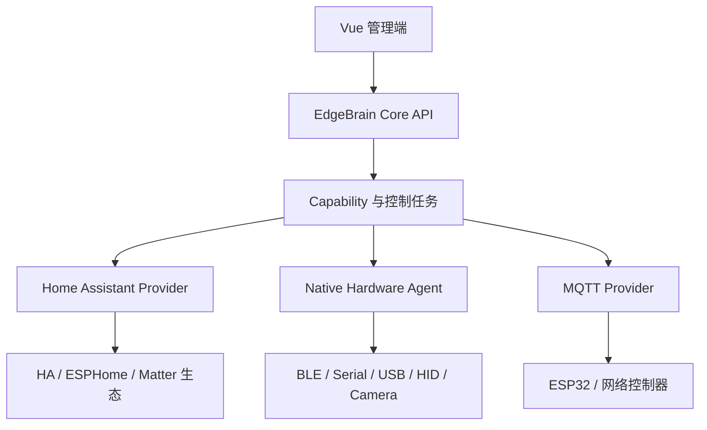

# ADR-0001：平台技术栈与设备运行时

- 状态：已接受
- 日期：2026-08-28
- 决策人：EdgeBrain 项目

## 背景

EdgeBrain 既要管理设备、控制器方案、配件、采购、库存和待办，也要从电脑直接操作 BLE、Bluetooth Classic、Serial、USB/HID、摄像头和网络设备。未来还要部署到 ARM64 树莓派一类 Linux 主机。

单一开源物联网平台无法同时覆盖这些业务。完全自研设备生态会重复实现发现、连接、状态同步、固件和协议驱动；直接基于 Home Assistant、ThingsBoard 或 EdgeX 二次开发，又会把采购和资产模型锁进不合适的平台边界。

## 决策

采用“EdgeBrain 业务核心 + Provider 设备运行层”的组合架构。

### 自研并沉淀

- 控制器方案、BOM、配件图片与详细档案；
- 采购、验收、库存和待办；
- Capability 契约、风险策略、控制任务和审计；
- AI 与语音意图到结构化控制任务的映射；
- Provider 之间统一的设备与状态模型。

### 直接复用

- Home Assistant 的 Device/Entity/Service 生态，通过正式 REST/WebSocket API 对接，不 Fork、不读内部数据库；
- ESPHome 用于常见 ESP32 传感器、继电器、红外和 BLE Proxy；特殊或量产控制器使用 ESP-IDF；
- Mosquitto 作为 MQTT Broker；
- Bleak、pyserial、libusb/hidapi 等作为 Native Agent 底层库；
- EdgeX Device Profile 的资源/命令建模思想；
- ThingsBoard Gateway 的 Connector/Converter/Event Storage 插件思想，不部署完整 ThingsBoard Server。

## 技术选型

| 范围 | 选择 |
|---|---|
| Web UI | Vue 3、TypeScript、Vite、Pinia、Vue Router、Element Plus |
| 积木编程 | Google Blockly、Zelos Scratch 风格渲染、JSON 序列化 |
| 未来 3D 工作台 | TresJS/Three.js、glTF 2.0；Foundation 0 不实现 |
| Core API | Python 3.12、FastAPI、Pydantic、SQLAlchemy、Alembic |
| 首期数据库 | SQLite 文件数据库；多人/远程部署后迁移 PostgreSQL |
| Native Agent | Python 独立进程；驱动插件化，后续可在不改变契约的前提下替换为 Rust |
| 本地通信 | Core 到 Agent 首期使用仅监听回环地址的 HTTP；稳定后评估本地 gRPC |
| 设备消息 | MQTT 5，命令必须带幂等键、过期时间和结构化结果 |
| 本地模型 | ModelAdapter，首个实现为 Ollama；不依赖云端 API 密钥 |
| 桌面封装 | 首期本地服务 + 浏览器；稳定后使用 Tauri 2 |

## 蓝牙边界

BLE 广播、GATT、Bluetooth Classic RFCOMM、HID 和音频不是同一个协议。每种驱动单独声明平台支持能力。

- BLE 首期使用 Bleak：macOS 走 CoreBluetooth、Linux/树莓派走 BlueZ、Windows 走 WinRT。
- 不把 MAC 作为跨平台唯一身份。macOS 可能返回与本机相关的 UUID，绑定时组合使用系统标识、Service UUID、Manufacturer Data、GATT 序列号和人工确认。
- ESPHome Bluetooth Proxy 仅解决 BLE，不宣称支持所有 Bluetooth Classic 设备。
- HID、音频和系统已配对设备通过各自 OS Provider 管理。

## 跨平台部署规则

- 正式目标为 macOS arm64/x86_64、Linux arm64/x86_64；Windows 后续加入。
- Core/UI 可以容器化；需要 D-Bus、`/dev/tty*`、`/dev/hidraw*`、USB 或摄像头权限的 Hardware Agent 默认运行在宿主机。
- 设备绑定保存稳定硬件信息，不写死 `/dev/ttyUSB0` 等易变路径。
- 所有构建和依赖必须能生成 ARM64 产物。

## 未采用方案

- 不部署完整 EdgeX：首期本地产品过重。
- 不以 ThingsBoard 为业务主平台：其设备/遥测模型无法承载采购和配件业务，且会造成双 UI、双数据模型。
- 不把 Home Assistant 作为 EdgeBrain 主数据库：避免内部版本变化和业务模型错配。
- 不让浏览器直接控制 Web Bluetooth/Web Serial：跨浏览器能力和后台权限不足。
- 不在首期引入微服务、Kafka、Redis、Celery。

## 影响

正向影响是大量复用成熟设备生态，同时保持产品业务自主；Mac 到树莓派的迁移主要是 Agent 驱动和部署方式变化。代价是必须维护清晰的 Provider 契约和外部 ID 映射，并对各平台硬件权限做单独验收。

## 积木编程决策

采用 Blockly 作为嵌入式积木编辑器，使用 Zelos 渲染器获得接近 Scratch/MakeCode 的视觉形态。不采用完整 Scratch VM：EdgeBrain 不需要精灵、舞台和动画运行时，而且硬件自动化必须经过自己的安全执行器。

Blockly 工作区 JSON 仅用于保存和还原编辑状态。运行时先编译为版本化 `Automation IR`，执行器只接受触发器、条件、等待和白名单 Capability，不生成或执行任意 JavaScript/Python。AI 同样只能生成 Automation IR，经校验后再转成可编辑积木。

## 未来 3D 工作台决策

3D 装配视图采用 Vue 生态的 TresJS 和底层 Three.js，模型交换格式统一为 glTF 2.0/GLB。3D 场景不是第二套 BOM 或接线数据库：场景中的配件、端口和连线都映射现有控制器方案实体，并通过同一服务端规则校验。该模块已存档，但不进入 Foundation 0。

## 参考资料

- Home Assistant 设备与服务：https://developers.home-assistant.io/docs/architecture/devices-and-services/
- Home Assistant WebSocket API：https://developers.home-assistant.io/docs/api/websocket/
- ESPHome Bluetooth Proxy：https://esphome.io/components/bluetooth_proxy/
- EdgeX Device Profiles：https://docs.edgexfoundry.org/4.1/microservices/device/details/DeviceProfiles/
- ThingsBoard Gateway Connectors：https://thingsboard.io/docs/iot-gateway/connectors/
- Bleak macOS backend：https://bleak.readthedocs.io/en/develop/backends/macos.html
- Blockly JSON 序列化：https://developers.google.com/blockly/guides/configure/web/serialization
- Blockly Zelos 渲染器：https://developers.google.com/blockly/reference/js/blockly.zelos_namespace.renderer_class
- TresJS：https://docs.tresjs.org/
- glTF 2.0：https://registry.khronos.org/glTF/specs/2.0/glTF-2.0.html
